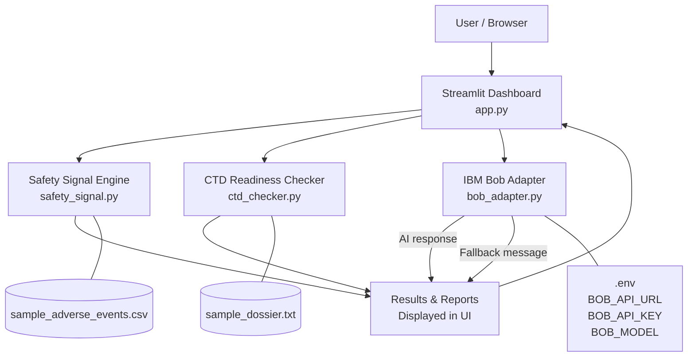

# Architecture

## 1. System Overview

PharmaGuard AI is a single-process Python web application. All computation runs locally in the browser session via Streamlit's server model. There is no database, no background service, and no required external API (IBM Bob is optional).

The application is structured into four focused Python modules plus the Streamlit frontend:

| Module | File | Responsibility |
|---|---|---|
| Streamlit UI | `app.py` | Navigation, user input, results display, downloads |
| Safety Signal Engine | `safety_signal.py` | PRR calculation, contingency table, signal flagging |
| CTD Readiness Checker | `ctd_checker.py` | Keyword matching, module scoring, gap detection |
| IBM Bob Adapter | `bob_adapter.py` | AI integration with graceful fallback |
| Synthetic Data | `data/` | Demo CSV and dossier text |

---

## 2. Architecture Diagram



ASCII fallback (for environments without Mermaid):

```
User
  │
  ▼
Streamlit Dashboard (app.py)
  ├──── Safety Signal Engine (safety_signal.py)
  │          └── PRR Calculation + Signal Ranking
  ├──── CTD Readiness Checker (ctd_checker.py)
  │          └── Keyword Matching + Module Scoring
  └──── IBM Bob Adapter (bob_adapter.py)
             ├── [Configured] → IBM Bob REST API → AI Text
             └── [Not configured] → Fallback message
  │
  ▼
Results Displayed + Downloads Generated
```

---

## 3. Components

### Streamlit UI (`app.py`)

- **Home page** — Feature overview cards, how-it-works steps, limitations disclaimer
- **Safety Signal Detection page** — CSV upload/sample selector, threshold sliders, PRR results table, signal expanders, download button
- **Submission Readiness page** — Dossier text upload/paste/sample selector, module score metrics, requirements table, gap report, download buttons
- **Sidebar** — Navigation, IBM Bob connection status, global disclaimer

### Safety Signal Engine (`safety_signal.py`)

**`AdverseEventRecord`** — dataclass representing one input row (drug, event, count)

**`PRRResult`** — dataclass representing one PRR result (drug, event, a, b, c, d, prr, is_signal)

**`compute_prr(records, prr_threshold, min_count)`** — main computation function:
1. Aggregates pair counts, drug totals, event totals, grand total using defaultdict
2. For each (drug, event) pair: computes a, b, c, d
3. Computes PRR = (a/(a+b)) / (c/(c+d))
4. Handles division-by-zero safely (returns inf when event exclusive to one drug)
5. Flags signals: PRR ≥ threshold AND a ≥ min_count
6. Returns results sorted by PRR descending

### CTD Readiness Checker (`ctd_checker.py`)

**`CTD_CHECKLIST`** — configurable dictionary mapping module IDs to (module_name, list of (requirement_label, keywords))

**`RequirementStatus`** — dataclass: module_id, module_name, requirement, found, matched_keywords

**`ModuleScore`** — dataclass: module_id, module_name, found, total, score_pct

**`DossierReport`** — aggregated report with: total_requirements, found_count, missing_count, completeness_pct, module_scores, missing_requirements, found_requirements, is_submission_ready

**`check_dossier(dossier_text, checklist)`** — main function:
1. Validates input (must be non-empty string)
2. Converts text to lowercase
3. For each requirement in checklist: checks if any keyword appears in text
4. Returns DossierReport

### IBM Bob Adapter (`bob_adapter.py`)

**`_get_config()`** — reads BOB_API_URL, BOB_API_KEY, BOB_MODEL from environment

**`is_configured()`** — returns True when URL and API key are present

**`_call_bob(prompt)`** — sends HTTP POST to BOB_API_URL with bearer auth; parses watsonx-style or OpenAI-compatible response; returns None on any error

**`explain_signal(drug, event, prr, a, b, c, d)`** — builds pharmacovigilance prompt, calls Bob, returns explanation or useful fallback

**`summarize_gaps(module_scores, missing_requirements)`** — builds gap summary prompt, calls Bob, returns summary or structured fallback

### Synthetic Data

**`data/sample_adverse_events.csv`** — 89 rows, 10 fictional drugs, ~15 event types, realistic count distributions

**`data/sample_dossier.txt`** — ~400 lines, covers all CTD Modules 1–5 for a fictional product "NovaCept-200"

---

## 4. Safety Signal Data Flow

```
CSV File
  │
  ▼ pd.read_csv()
Raw DataFrame
  │
  ▼ Column validation (drug, event, count required)
  │ Count type coercion (numeric, drop NaN, drop zero)
  │ Drop rows with empty drug/event
Validated DataFrame
  │
  ▼ [AdverseEventRecord(drug, event, count) for each row]
List[AdverseEventRecord]
  │
  ▼ compute_prr(records, prr_threshold, min_count)
  │   defaultdict aggregation → pair_counts, drug_totals, event_totals, grand_total
  │   For each (drug, event):
  │     a = pair_counts[(drug,event)]
  │     b = drug_totals[drug] - a
  │     c = event_totals[event] - a
  │     d = grand_total - a - b - c
  │     PRR = (a/(a+b)) / (c/(c+d))  [with zero-division guard]
  │     is_signal = PRR >= threshold AND a >= min_count
List[PRRResult] sorted by PRR descending
  │
  ▼ Streamlit display: metrics, ranked table, signal expanders
  │
  ▼ Optional: explain_signal() → IBM Bob or fallback
  │
  ▼ Download: results_df.to_csv()
```

---

## 5. Submission Readiness Data Flow

```
Dossier Text (paste / file upload / sample)
  │
  ▼ Input validation (non-empty string, minimum length warning)
Validated text string
  │
  ▼ text_lower = text.strip().lower()
  │
  ▼ check_dossier(text, checklist=CTD_CHECKLIST)
  │   For each module_id → (module_name, requirements):
  │     For each (req_label, keywords):
  │       matched = [kw for kw in keywords if kw in text_lower]
  │       found = len(matched) > 0
  │       → RequirementStatus(module_id, module_name, req_label, found, matched)
List[RequirementStatus]
  │
  ▼ DossierReport aggregation:
  │   module_scores = aggregate by module_id
  │   completeness_pct = found_count / total_requirements * 100
  │   missing_requirements = [r for r if not r.found]
  │
  ▼ Streamlit display: overall metrics, module score metrics, bar chart,
  │   requirements table, missing requirements list
  │
  ▼ Optional: summarize_gaps() → IBM Bob or fallback
  │
  ▼ Download: gap_report.txt, requirements.csv
```

---

## 6. IBM Bob Integration Flow

```
User clicks "Explain Signal" or "Generate Gap Summary"
  │
  ▼ bob_adapter.explain_signal() or summarize_gaps()
  │
  ▼ _get_config()  →  reads BOB_API_URL, BOB_API_KEY, BOB_MODEL from os.environ
  │                    (loaded from .env by python-dotenv at startup)
  │
  ├── [Not configured: URL or KEY empty]
  │     └── Return fallback string  →  Displayed in st.info()
  │
  └── [Configured]
        ▼ Build JSON payload: {model, prompt, max_tokens, temperature}
        ▼ urllib.request.Request POST to BOB_API_URL
          Authorization: Bearer {BOB_API_KEY}
          Content-Type: application/json
        │
        ├── [HTTP success]
        │     ▼ Parse response:
        │       Try: results[0].generated_text  (watsonx format)
        │       Try: choices[0].text             (OpenAI format)
        │       Try: generated_text              (simple format)
        │     └── Return parsed text  →  Displayed in st.info()
        │
        └── [HTTP error / URLError / timeout / unexpected format]
              └── Return fallback string  →  Displayed in st.info()
```

---

## 7. Security

| Concern | Mitigation |
|---|---|
| API key exposure | Read-only from environment variables; `.env` is in `.gitignore` |
| No hardcoded credentials | `.env.example` contains only placeholders, safe to commit |
| Input validation | All user inputs validated before processing |
| No shell execution | Pure Python — no subprocess or shell commands |
| Synthetic data only | No real patient or regulatory data in repository |
| Dependency security | Minimal, well-known packages (streamlit, pandas, numpy, python-dotenv) |

---

## 8. Scalability and Future Improvements

This prototype demonstrates core concepts. Future improvements could include:

| Improvement | Description |
|---|---|
| Database backend | PostgreSQL or SQLite for persistent signal tracking |
| Batch processing | CLI mode for processing large FAERS exports |
| Statistical confidence | Add chi-squared test and 95% CI for PRR signals |
| NLP-based dossier parsing | Replace keyword matching with semantic search |
| Audit trail | Log all calculations with timestamps for regulatory audit purposes |
| Multi-drug comparison | Side-by-side PRR profiles for competitor drugs |
| Real-time FAERS integration | Direct API connection to FDA FAERS public data |
| User authentication | Multi-user support with role-based access |
| Configurable checklists | UI for editing the CTD checklist without code changes |
| Export to PDF | Generate formatted PDF gap reports |
